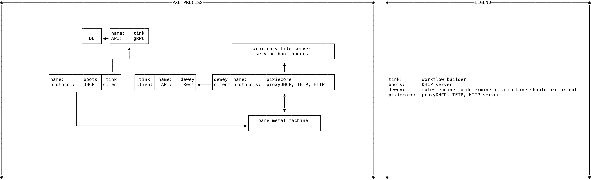

# tinkerbell.next

demo repo for a rethink of the Tinkerbell stack architecture

## Architecture



## Prerequisites

* Working DHCP server
  * If you're running this from a home network, whatever DHCP server you have for your local computers will work.
* Linux machine to run the stack
  * If you're on a mac, you'll need a linux VM
  * It will need to have an adapter thats connected to the same network as the DHCP server
* A machine to PXE boot
  * If you're on a mac, a VM with a network adapter that is connected to same network as the stack and DHCP server

## Usage

1. Start the stack

```bash
docker-compose up -d
```

2. Add the hardware data to tink-server

```bash
# using the hook operating system installation environment
docker exec -i tinkerbellnext_tink-cli_1 tink hardware push < ./hardware-data/hook.json

# using the default OSIE
docker exec -i tinkerbellnext_tink-cli_1 tink hardware push < ./hardware-data/osie.json

# boot to netboot.xyz
docker exec -i tinkerbellnext_tink-cli_1 tink hardware push < ./hardware-data/netboot-xyz.json
```

3. Boot the machine - make sure the machine you want to PXE is set to boot from the network adapter
